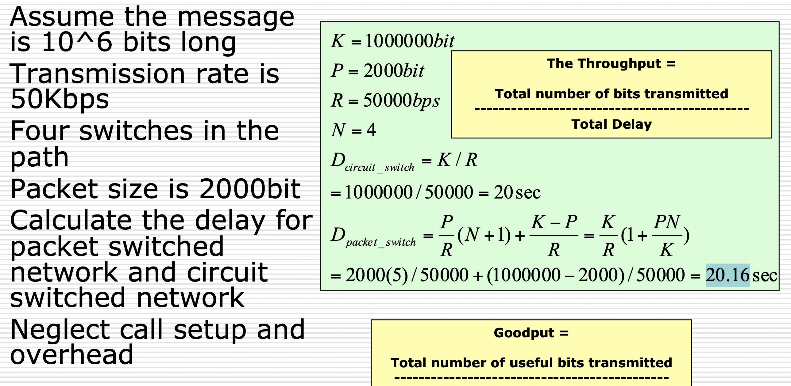

# Data Communication Final Exam

- 6장 Digital Data Communication Techniques
    - 타이밍이 중요하다
    - 수신자가 bit 받고, clock이 제대로 안되어 있다면 잘못 보내질것에 조심
    - 동기화 예
        - Asynchronous
            - 짧은것만 보내서 해결 (5~8)
            - 수신자는 새로운 캐릭터 받을 때 마다 재동기화 가능
            - 싸고 간단함
            - 키보드 같은것에 좋다
            - 시작과 종결 코드를 같이 보낸다
        - Synchronous
            - 시작과 종결 코드 없이 보낸다 → 그래도 명시는 해줘야됨
            - clock이 동기화가 되어야 한다 (separate clock / embed clock signal in data)
            - 시작과 끝을 명시 해 줘야된다
            - preamble(start) postamble(end) bit pattern 사용
            - 더 효율적이다
    - 에러의 예
        - 1비트 에러
            - white noise나 하나만 발생
        - 버스트 에러
            - 연속적으로 비트들이 에러로 받는다
            - impulse noise나 fading 으로 발생 → 높은 데이터율에서 더 타격이 큼
    - 에러 찾는과정
        - 에러는 무조건 생김 → 에러 디텍션 코드로 찾을 수 있다
        - 수신자가 찾고 계산 및 체크 가능
        - 그래도 못찾는 에러 있을수 도 있다
        - 패리티비트로 체크
            - 홀수로 체크, 짝수로 체크
        - CRC
    - 에러 고치는과정
        - data block 재전송을 필요로 한다
        - 무선에는 별로 안좋음 → 에러 높을수록 재전송이 많이 해야되고 왔다갔다 길수록 전송시간에 많이 쏟게된다
        - codeword
            - 전송 끝에 k-bit block을 추가로 보내서 FEC(forward error correction encoder)사용 → decoding 시 에러를 고치거나 최소 ㅊ찾을 수는 있다
        - 전송될 때 중복성을 넣어서추론 할 수 있게 만든다
    - Topology
        - line configuration - topology → 실제 물리적 연결
        - point to point → 두개의 라우터나 컴퓨터
        - multi point → computer 와 terminal (LAN)
    - Half / Full Duplex
        - Half duplex
            - 한번에 한 방향밖에 갈 수 없다
            - 한 data path 필요
        - Full duplex
            - 전송과 수신을 동시에 할 수 있다
            - 두가지 data path 필요.
            - 한 direction 마다 다른 media나 frequency가 사용된다
- 7장 Data Link Control Protocols
    - Flow Control
        - 보내는 객체가 받는 객체를 넘치지 않게 → 오버플로우 방지
        - transmission time : 전송시간(media에서 data가 방출되는 시간), propagation time (링크를 전송하는 시간)이 중요
        - Stop and Wait
            - 송신자가 전송하고, 수신자가 ACK 로 답하고 ACK를 송신자가 받으면 다음 전송 가능.
            - 큰 frame에서 효율적이다
            - 큰 frame을 짧게 쪼개는 순간 너무 많이 기다려야됨
        - Sliding Windows Flow Control
            - 여러 프레임을 보낼 수 있게
            - W 길이의 buffer가 있다
            - ACK없이 W만큼 전송 (ACK에 다음 받아야 할 frame)
            - 수신자는 RNR로 준비 안됐다고 전송 할 수 있음
        - 에러 컨트롤 기술
            - lost frame(아예 도착도 못함) 이나 damaged frame(손상됨) 이 온다
            - error detection → ACK → retransmission
            - ARQ(Automatic Repeat Request)
                - 에러 컨트롤 기술중에 하나
                - 어떠한 신뢰 안되는 데이터를 신뢰가능하게
                - STOP AND WAIT
                    - ACK를 기다린다 → 오기전까지 전송 안됨
                    - 송상된 데이터라면 그냥 버리고 타임아웃 걸려 재전송된다
                    - ACK가 손상되면 송신자가 이해를 못하니까 재전송을 한다
                    - 수신자는 같은 frame 두개가 생기고 ACK0 /ACK1 두개 사용
                - GO BACK N
                    - 가장 많이 쓰이는 기술
                    - Sliding Window처럼 사용
                    - 윈도우 크기로 frame을 조절
                    - 에러가 없다면 ACK는 평소대로 사용
                    - 에러가 있다면, 거절을 한다
                        - 수신자가 고장난 프레임 버리고 거기서부터 다시 다 받아야됨
                    - 손실난 프레임이라면
                        - 그 프레임 거절하고 거기서부터 재전송
                    - 아예 못받으면
                        - 다음거 보냈을 때 수신자가 다음게 왔으니까 거절하고 다시 보내야됨 아니면 송신자가 타임아웃 걸려서 못받은 곳 부터 재전송
                - Selective Reject
                    - 선택적 재전송이라고도 불린다
                    - 이상한 프레임만 재전송하면됨
                    - 다른 프레임들은 수신자가 잘 받고 알아서 버퍼에 저장한다
                    - 재전송을 최소화, 하지만 수신자가 버퍼 크게 잘 가지고 있어야된다 → 구현하게 어려움
                    - propagation이 긴 (실제 전송시간) 위성통신에서 사용
    - HDLC (High Level Data Link Control)
        - 가장 중요한 데이터 링크 컨트롤 기법이다 → 데이터 전송기법
        - Unbalanced
            - Primary → Link 의 수행을 컨트롤
            - Secondary → Primary Station 보조
        - Balanced
            - Combined → full / half duplex 둘다 동작 → 명령과 동작을 관리
    - HDLC Transfer Mode
        - NRM (Normal Response Mode)
            - unbalanced에서 사용 → primary가 전송을 시작
        - Asynchronous Balanced mode (ABM)
            - balance한 상황에서 사용 → full duplex
            - 둘중 어느거나 먼저 전송을 해도 된다
            - 선택하는곳에 있어서 딜레이가 없다 → 제일 많이 씀
        - Asynchronous Response Mode (ARM)
            - unbalanced 에서 사용
            - secondary가 primary의 허용 없이 전송 할 수 있음
    - HDLC 구조
        - synchronous한 전송을 한다 → frame형태로 쪼개짐
        - bit stuffing으로 채운다
            - 1 다섯개가 나오고 0을 넣는 구조
        - address field
            - 8bit 의 길이고, 11111111은 boradcast용으로 사용
        - control field
            - 다른 frame type 을 사용한다
                - information → user에게 전송 (피기백 사용)
                - supervisory → ARQ에 피기백 하는거 사용 안함
                - unnumbered → 보조적인 장치로 사용
            - Poll / Final bit 로 peer 에서 받는지 soliciting command인지 판단
    - FCS Field → go back n 으로 구성
        - Information
            - I 와 U 프레임에 있음
            - 옥텟 포함되어야함 → 가변길이
        - FCS → error detection 시 사용, 16이나 32bit CRC
- 8장 Multiplexing
    - 물리적으로 선 한개
    - 길고 높은 capacity의 링크 → FDM 인지 TDM인지
    - FDM (Frequency Division)
        - 아날로그 캐리어 시스템
            - 긴 링크 → FDM에서 사용
            - (일반 그룹) 12개의 음성 채널 → 48khz, 범위는 60khz to 108khz
            - (수퍼 그룹) 5개의 FDM 시그널은 총 60채널 운용 가능, 420khz to 612khz
            - (마스커 그룹) 10개의 수퍼그룹으로 600채널 운용 가능
        - WDM (Wavelength Division
            - 다양한 주파수로 여러 빔을 쏜다
            - optical fiberx로 전송됨
            - FDM과 유사함.
            - Dense WDM 은 더 많은 채널을 사용하고, 더 따닥따닥 붙음
    - TDM (Time Division)
        - 헤더나 트레일러 없음 (synchronous 처럼) → stop and wait?
        - 데이터 링크 컨트롤 프로토콜 필요 없음
        - 플로우 컨트롤
            - 데이터 전송률이 고정됨
            - 한 수신채널이 수신 안되면 다른애들이 해줘야됨
            - 해당 수신채널은 꺼진다
            - 빈 공간들은 그냥 두고감
        - 에러 컨트롤
            - 에러 찾을 수 있고, 알아서 해결할 수 있음
        - Statistical
            - 동기화 TDM에서 버려지는게 넘 많음
            - 타임을 쪼개서 할당한다
            - 멀티플렉서에서
    - Framing
        - flag 나 동기화가 없음 → TDM의 종류?
        - 그래도 동기화 지원해줘야됨. 수신과 송신의 클럭 맞추기
        - 한 컨트롤 비트가 TDM에 추가됨
        - 구별 가능한 비트 패턴이 컨트롤 채널에서 사용됨
        - 수신하는 애들이 들어오는 비트들을 예상하는 애들과 비교해서 맞춤
    - Pulse Stuffing
        
        펄스에 비트를 추가해서 클럭을 맞추는 역할을 한다. 
        
        추가됐다가 demultiplexer에서 다시 없어짐
        
    - SONET/SDH
        
        Synchronous Optical Network
        
        Synchronous Digital Hierarchy
        
        → optical fiber용 매우 높은 전송률
        
        신호율의 계층을 보여줌
        
    - Cable Modem
        - Downstream
            - cable 스케줄러가 작은 패킷으로 쪼개서 전달
            - 구독자들이 다운스트림을 공유한다
            - 업스트림 타임슬롯을 구독자들에게 할당 시켜 줄 수 있다
        - Upstream
            - 유저가 타임슬롯을 요구한다
            - 스케줄러가 구독자에게 쓸 수 있게 해준다
    - ADSL (Aysnchronous digital subscriber line)
        - 구독자와 네트워크 사이의 링크
        - 요새는 보통 twisted pair cable사용
        - 비대칭이다 → 보통 다운스트림이 더 크다
        - FDM을 쓴다. → 주파수로 쪼개서 사용
    - DMT
        
        다른 주파수에서 다른 신호 캐리어를 사용한다
        
        4khz subchannel로 나눠서 사용
        
        noise가 더 줄어든다
        
    - Boradband
        - Customer side
            - DSL링크는 provider, customer사이에 링크
            - 구분자는 텔레폰과 데이터 서비스를 제공
            - 데이터 서비스는 DSL모뎀을 사용한다
            - DSL 시그널은 비디오와 데이터로 나눠진다
        - Provider side
            - 구분자는 텔레폰과 인터넷을 나눈다
            - 음석은 PSTN으로 연결됨
            - 데이터는 DSLAM으로 연결되어 여러 DSL과 소통 할 수 있게 해준다. 하나의 ATM line과 연결. → ATM switcher로 연결되어 인터넷을 제공
        - xDSL
            - 높은 데이터율의 DSL
            - 하나의 DSL Line이다.
- 9장 Spread Spectrum
    - 무선통신에서 중요한 방법이다
        - Frequency Hopping
        - Direct Sequence
    - 방해하기가 더 어려움
    - 아날로그 시그널로 아날로그와 디지털 데이터를 전송
    - 넓은 대역폭으로 전송한다
    - Pseudorandom Number
        - seed로 시작하기 때문에 엄청나게 랜덤하지는 않다
        - 알고리즘과 어떠한 결과를 예측 할 수 있어야된다
        - 수신자만 시그널을 해석 할 수 있어야 된다
    - Input data → 채널 인코딩 / Analog signal → 변조기/Modulator (수도noise 생성) → 채널 → Demodulator (pseudonoise) → 채널 디코더 → 아웃풋
    - noise와 multipath distortion에 영향을 받지 않는다
    - 시그널을 숨기거나 암호화 할 수 있다
    - 여러 유저들이 높은 대역폭에서 공유를 할 수 있다 → CDM/CDMA
    - FHSS (Frequency Hopping Spread Spectrum)
        - signal이 다소 랜덤한 주파수로다가 전송된다
        - 수신자는 주파수를 뛰어다니며 송신자와 동기화한다
        - 정해진 부분만 들을 수 있다
        - 어떠한 주파수를 전파방해 하는거는 조금만 영향이 간다
        - Slow & Fast FHSS
            - 여러 FSK(Frequency Shiftking Key)를 사용한다
            - 매 몇Tc seconds마다 주파수가 이동
            - Ts seconds동안만 유지된다
            - Slow FHSS Tc ≥ Ts
            - Fast FHSS Tc < Ts
    - DSSS ( Direct Sequence Spread Spectrum)
        - 매 비트는 여러 비트를 대표한다 → Spreading code로
        - 이러한 Spreads signal은 더 넓은 주파수 밴드를 떠돌아 다닌다
        - FHSS와 비슷한 성능
    - CDMA (Code Division Multiple Access)
        - Spread spectrum 에 사용된 multiplexing technique
        - Data signal rate → D
        - 매 비트를 k chips로 쪼개어 각 유저에게 chipping code를 할당
        - 새로운 채널은 chip data rate kD chips per second 각 유저에게 개인적인 code를 전달
        - 여러 채널이 준비된다
- 10장 Circuit Packet
    - Switched Communication Networks
        - Switching nodes → 노드끼리 데이터 움직일 수 있게 해준다
        - station → network 에 연결된 디바이스
        - 노드 → 통신을 하게 해주는 스위칭 디바이스
            - transmission link로 연결됨
            - point to point 연결
            - FDM 이나 TDM 으로 멀티플렉스됨
        - communication network → collection of nodes
    - switching과 추가로, 어떤 노드들은 데이터를 전달한다
    - 네트워크는 완전 연결된게 아니라 노드들 사이에 직접 링크는 아니다
    - 불필요한 연결들은 네트워크의 안전성을 높여준다
        - circuit switching / packet switching
    - Circuit Switching
        - 정해진 루트를 따라간다 → 3가지의 단계가 있음
            - Establish
            - Transfer
            - Disconnect
        - 다소 비효율 적 일 수 있음
            - 어떤 시간동안, 다른 사람이 개입 못하는 채널을 사용
            - 데이터가 없으면, 그냥 공간만 차지한다
            - 콜 하고 픽업하는 동안 시간이 소모된다
        - Public telecommunications network
            - 구독자 - 네트워크에 연결되는 디바이스
            - 구독자 라인 - 구독자와 네트워크를 연결
            - 교환 - 네트워크를 교환
            - 트렁크 - 교환들을 연결시켜준다
            - Data switch - digital data를 연결 - 터미널과 컴퓨터
            - private branch exchange - 빌딩사이에 연결
        - Technology
            - 음성을 제어하기 위한 기술로 개발됨
                - 딜레이가 없음
            - 아날로그 전송에 유용하고, 디지털 전송에는 효율이 안좋다
            - digital switch → full-duplex 이며 투명한 시그널
            - network interface → 하드웨어와 기능들이 디지털 디바이스에 연결
            - control unit → connection을 쪼갠다
        - Blocking
            - 모든 경로가 사용줄 일 때 사용 할 수 없을수도 있다
            - 음성채널에 사용된다. 어차피 통화를 짧게 사용할 것을 알고 있기 때문
        - Non-Blocking
            - 모든 연결을 다 받아준다
            - 모든 가능한 요구사항을 다 받아준다/ 가능 할 때 까지
        - Space Division Switching
            - analog를 위해서 설계되었고, digital 까지 사용됨
            - 시그널 경로가 물리적으로는 떨어져 있다
            - 경로가 전송 시그널에 할당되어 있다
            - data communication 에서는 효율적이지 않다. stage에서 어디로 연결할지 결정해서 path를 결정 → crosspoint에서 결정
        - Time Division Switching
            - 요새 나오는 디지털 시스템들이 사용한다
            - set up 과 가상 circuit을 구성하려고 사용
            - 느린 비트 스트림을 쪼개서 높은 스피드로 사용한다
            - 모든 조각들이 결국 input to output으로 조작된다
        - Softswitch Architecture
            - 요새 나오는 제일 최근 circuit switching 방법
            - 제일 적은 요금으로 효율이 제일 좋다
            - 미디아 게이트웨이 → 물리적 스위칭 으로 연결
    - Packet Switching
        - Data 전송을 위해서 만들어져 패킷으로 쪼개서 전송 → 잠시 저장되어 다음 노드로 전송됨
        - 패킷은 유저 데이터나 제어정보를 가지고 있다
        - 제어정보에 루팅하는법도 있음
        - line efficiency
            - 하나의 링크는 많은 패킷에 공유된다
            - 패킷들은 큐 되어 빠르게 빠르게 전송된다
        - data rate conversion
            - 기관들은 자신의 스피드로 전송한다
            - 요청된 겨웅 노드버퍼는 동일한 비율로 저장된다
        - 패킷은 네트워크가 바빠도 받아들인다
        - 우선순위 시스템이 도입되었다
        - Swithcing 기술
            - 기관들이 메시지를 패킷으로 쪼갠다
            - 패킷은 네트워크로 전송된다
                - datagram - 각 패킷은 개별로 취급되어 전 패킷에 관심이 없다 (다 따로따로 전송)
                    - 미리 준비하는 과정이 없어서 유연하다
                    - 더 안전함 → 하나 고장나면 다른 길
                    - 메세지가 짧을수록 효율적
                - virtual circuit - 미리 지정된 루트로 되어 패킷이 전송되기 전에 미리 알고있음 (같은 방향으로)
                    - 더 빠르게 전송된다
                    - network가 순서랑 에러를 잡을 수 있음
                    - 신뢰가 덜.. → 고장나면 망함
                    - 메세지가 길수록 더 좋다
        - 패킷을 더 짧게 쪼갤수록 좋은게 아님 → 길어도 당연히 안됨, 적당하게
    - External Network Interface
        - ITU-T standard for host 와 패킷 스위칭 네트워크
            - 가장 일반적이다
            - Physical / Link / Packet 으로 구성
    - Circuit vs Packet Switching
        - 성능은 여러 delay에 따라 갈린다
            - 전송되는 시간 (node to node)
            - 전송하는 시간 (node에서 send 할 때 까지)
            - 노드간의 delay
        - 특징들이 각 각 있음 → transparency, amount of overhead
- 11장 ATM
    - ATM은 패킷을 cell이라 부른다
    - cell은 작고 고정된 길이로 사용된다 → connection oriented → circuit 처럼
    - circuit의 성능과 packet의 효율과 유연성을 가진다
    - data, voice, video 다 쓸 수 있고, 우선순위와 quality에 따라 달라진다
    - packet switching / frame relay 와 유사하다
    - 오류가 적고 flow control이 쉽다 → 높은 데이터 전송률
    - user plane : user information transfer
    - control plane : call and connection control
    - management plane : 전부 관리하고, 플레인들을 조화
    - switch들은 point to point ATM링크 된다 → interface
        - UNI (User Network Interface) → 유저와 네트워크간
        - NNI (Network node interface) →  같은 네트워크간
    - ATM 논리적 연결 → multiple logical connections over single physical interface
        - VCC (virtual channel connections)
            - virtual circuit의 아날로그 형태
            - 유저와 네트워크의 교환
            - 네트워크와 네트워크사이의 교환
        - 두 엔드 유저 사이에서의 연결 → 전송률, full duplex, size cell 고정
        - ATM의 가상 연결 (VPC) 는 VCC 다발로 이루어진다
        - 가상연결의 장점
            - 네트워크 구조의 간단화
            - 효율을 높히고 안전성도 높힌다
            - 짧은 setup time, 네트워크 서비스 발전
        - 가상 채널 관리
            - 두 엔드유저간
                - 데이터 전달, 컨트롤 시그널링, VPC로 제어 → VCC로 구성
            - 엔드유저 → 네트워크
                - 컨트롤 시그널링, VPC가 트래픽을 제어
            - 네트워크간
                - 네트워크 관리, 라우팅
            - 가상 채널의 특징
                - QoS, 셀의 무결성, 반영구적 채널 연결, 트래픽 관리
            - 가상 경로의 특징
                - QoS, 반영구적 채널 연결, 셀 무결성, VPC를 통한 제어
        - Control Signalling - VCC
            - VCC 나 VPC를 구성하는 법
            - 분리된 연결을 사용
                - 반 영구적 VCC를 사용
                - meta-signaling channel 사용
                - user-network, user-user signaling virtual channel 사용
        - Control Signaling - VPC
            - 반영구적 VPC 사용
            - customer / network controlled
    - ATM 헤더파일
        - 가상, 가상채널 identifier, payload type, cell loss 우선순위, 헤더 에러컨트롤...
    - GFC (Generic Flow Control)
        - control flow at user - network interface (UNI)
        - 모든 연결은 플로우 컨트롤 된다
        - uncontrolled 이거나 controlled 이거나 둘중 하나
        - default 이거나 2개의 그룹으로 연결됨.
        - TRASMIT = 1 이면 아무때나 전송, 0 이면 보내면 안된다
        - HALT 가 들어오면 TRANSMIT = 0 으로
            - 순환구조, 효율적으로 제한
        - TRANSMIT = 1이고 보낼 uncontroll이 없다면
            - GO_CNTR > 0 이면 control cell 보내도 된다. GO_CNTR—
            - GO_CNTR = 0 이면 그냥 유지
    - Cell Based Physical Layer
        - framing 없음
        - 연속된 53개의 옥텟 셀로 구성
    - SDH based physical layer
        - ATM stream의 구조
        - ATM 과 STM 담을 수 있음
        - SDH를 통해 circuit switch 가능
    - ATM Service Category
        - Real time : CBR, VBR
            - CBR (Constant Bit Rate) : 고정된 데이터율
                - 딜레이가 한정적으로 고정됨
                - 오디오나 비디오가 압축 안됨
            - VBR (Variable Bit Rate) : 민감한 정보들 → 딜레이에 제한적임
                - CBR보다 더 유연하게 사용가능
        - Non-Real time : ABR, UBR, GFR
            - VBR : 빨리 빨리 해야 할 때 사용
            - UBR (Unspecified Bit Rate) : 더 용량이 크다 → 조금 잃어버려도 괜찮음
            - ABR (Available Bit Rate) : least minimum cell rate 에 할당해준다
            - GFR (Guaranteed Frame Rate) : 프레임 기반 트래픽에 더 좋다 → IP/ Etherent, 더 효율적으로 LAN을 사용하는 경우 사용된다
- 12장 Routing
    - 패킷 스위칭에서 루팅
        - 보통 패킷 스윗칭에서 루팅이 사용된다. 두 엔드 노드간에 어떻게 연결을 할 것인지
        - minimum hop → 제일 많이 안 건너뛰는 곳 선택 : 제일 많이 씀
        - least cost →  제일 비용이 안되는 것 : 더 유연함
    - Decision Time / Place
        - Decision Time : 패킷이나 가상의 서킷 구성. 고성이거나 동적으로
        - Decision Place
            - 분산형태로, 각 노드가 만들고 더 복잡하다
            - 집중형 : 어떤 정해진 노드가
            - 소스형 : 소스 스테이션이 만든다
    - Network Information Source / Update Timing
        - 루팅 결정하는것은 보통 네트워크, 트래픽 얼마나, 링크 비용에 따라서 결정된다
            - 분산 루팅 : 미리 알고있는 지식 → 근접한 노드들 등의 잠재적 루트를 보고 결정
            - central routing : 모든 노드들의 정보를 알아야됨
    - Fixed Routing
        - 한 절대적인 경로를 소스마다 정해서 연결
        - least cost algorithm을 사용한다.
        - 루트가 결국 고정된다 → 네트워크 정보가 변할 때 까지
        - 간단하다 하지만 유연함이 부족함
    - Flooding
        - 패킷이 모든 이웃한 노드로 전송된다
        - 결국 많은 복제본들이 도착을 할 것이다
        - 네트워크 정보가 없어도 된다
        - 각 패킷은 번호가 지정되어 중복되는 것은 버릴 수 있음
        - 재전송 할 패킷을 제한해야됨 → 노드들을 다 기억하고, 건너뛸 때 마다 카운트 해줄 수 있음
        - 모든 가능한 루트를 시도해서 매우 힘들다 → 긴급한 메시지 전송 시 사용
        - 적어도 하나의 패킷은 최소 건너뛰는 루트를 가진다
        - 노드들은 간접적이나 직접적으로 연결된다
        - 단점 : 넘 비싸고 보안이 안좋다
    - Random Routing
        - flooding 의 단순함을 트래픽을 좀 덜 쓰게
        - 노드가 나가는 노드중에 어떤것을 재전송 할 지 결정
        - Round Robin 이나 랜덤으로 정해서 결정
        - 네트워크 정보가 필요없다
        - least cost  나 minimum hop 으로 전송된다
    - Adaptive Routing
        - 거의 모든 스위칭 네트워크가 이걸 사용한다
        - 라우팅 결정이 네트워크 현재 환경에 따라 계속 바뀐다
        - 네트워크에 대한 정보가 필요하다
            - 만들기 더 까다롭다
            - quality 와 overhead 사이에 잘 선택해야됨
            - 너무 빨리빨리 바뀌면 비효율적이다
            - 너무 천천히 바뀌면 정보가 관련이 없다는 것을 의미
        - 성능이 더 좋음 → 밀집되게 전송 → 디자인 따라 달라진다
        - local 에서
            - 나가는 링크를 구성하고, 각 경로에 바이어스 추가 할 수 있음 → 잘 안쓴다
        - 인접한 노드에서
            - 딜레이와 정보의 장점을 선택해서 분산이나 중심적으로 전달
    - Least Cost Algorithm
        - 라우팅 과정에서
            - 점프 뛰는것을 1로 고정
            - 한계를 넘지않게 설정
        - 코스트와 경로를 정의하고 어떻게 할 지 결정
            - 두 방향으로 링크 구성
            - 링크는 각 방향마다 얼마인지 알아야됨
        - 각 경로마다 제일 최소의 값을 찾고 들어간다
        - Dijkstra's Algo
            - 제일 짧은 경로를 탐색한다 → 한번에 하나씩 확장
            - 다음으로 선택
            - 각 노드들은 정보들을 미리 알고있어야 된다
            - 링크의 비용을 알고 있어야됨
            - 모든 노드들과 정보를 교환할 수 있어야 된다
        - Bellman-Ford Algo
            - 제일 짧은 경로를 탐색 → 한번에 여러개 확장 가능
            - n 계산시에 링크 비용 + 이때까지 비용 + 원래 비용 비교
            - 각 노드는 다른 노드들과의 경로를 다 알고있야됨
            - 다른 이웃들과 정보를 교환 할 수 있음
            - 비용과 경로를 정보들을 통해 업데이트 할 수 있음
        
- 기출 예상
    1. Let’s assume that 10001 is the data to transmit and we use polynomials of CRC-4 with P=1101, generate the CRC code and write the final frame that is to be transferred.(15)
    
    1. Hamming code with odd parity has been transmitted by the sender and 101101010 has been received at the reciever. Hamming code is known to be an error correction code. Can you find that error occurred during transmission?, please correct the error if you could find the error(15)
    
    1. When we mention data link control, we list some of the requirements and objectives for effective data communication between two directly connected transmitting-receiving stations. Please enumerate more than four of those requirements with proper explanation of their objectives.(15)
    
    - **Frame synchronization**. Data are sent in blocks called . The beginning and end of each frame must be recognized.
        
        frames
        
    - **Error control**. Any bit errors introduced by the transmission system must be corrected.
    - **Flow control**. The sending station must not send frames at a rate faster then the receiving station can absorb them.
    - **Addressing**. On a multipoint line, such as a LAN, the identity of the two stations involved in a transmission must be specified.
    - **Link management**. The initiation, maintenance, and termination of a data exchange requires a fair amount of coordination and cooperation among stations.
    
    1. In order to handle the errors during transmission, a technology called an ARQ(automatic repeat request) is used. ARQ is to turn an unreliable data link into a reliable one. Please explain three versions of ARQ using proper figures.(15)
    
    - Stop and Wait
        - 보내고 ACK 가 올 때까지 기다린다
    - Go Back N
        - Sliding Window에서 착안되었고, 에러가 없다면 ACK를 보내고 있다면, 거절을 하고, 그 때 N으로 돌아가서 다시 다 재전송 해야된다
    - Selective Reject
        - 어디서 거절을 당했는지 알고, 거절된 프레임만 재전송을 하면 된다
    
    1. Why is that the start and stop bits can be eliminated when character interleaving is used in synchronous TDM?(20)
    
    - The Start and Stop bits can be eliminated since all the data is placed in a frame. Removing the Start and Stop bits improves the efficiency of the transmission
    
    - Start and stop bits can be eliminated when character interleaving is used in synchronous TDM, they are removed by the sender and then reinserted by the receiver. This improves the efficiency of bit interleaving.
    
    - Because it reassigns time slots and fix it.
        
        
    1. Compare the circuit switching and packet switching in terms of performance. ATM is one the packet switching technology, however, it uses some of circuit switching techniques. Explain this with VCC and VPC of ATM.(20)
    
    - Performance 는 Propagation delay, transmission delay, node delay 에 따라 달라지는데, propagation과 transmission이 각 노드마다 동일하다 가정하면, node delay에 따라 달라지고, 노드가 커질수록, packet switching은 느려지지만, circuit switching은 관계가 없으므로, circuit switching 의 performance가 더 좋다.
    
    
    
    - ATM은 packet 전송을 하지만, circuit switching 처럼 전송하는 경로를 정해놓고 사용을 한다. 이러한 경로는 ATM의 Virtual Path Connection을 이용하고 이러한 connection 은 같은 end point 로 구성된 Virtual Channel Connection 들로 구성이 된다.
    
    1. 다익스트라 알고리즘 진행과정 표현
    
    
    
    집에서 test
    
    1. 벨만-포드 알고리즘 진행과정 표현
    
    1. ATM 전송모드 설명
