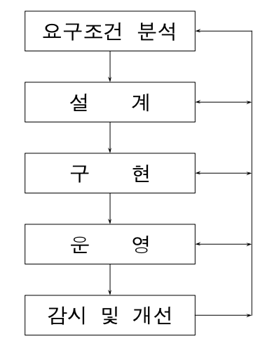

# Database의 설계

- 데이터베이스 설계 환경
    - 설계 다이어그램
        
        
        
        
        
    - 데이터베이스 설계 전략
        
        1. 데이터 중심(data-driven) DB 설계
        
        - DB 내용과 구조에 치중
        
        2. 처리 중심(processing-driven) DB 설계
        
        - 데이터의 처리와 응용(트랜잭션)에 치중
        
        ⇒ 병행적으로 추진
        
    - 데이터베이스 설계 고려사항
        - 무결성(integrity) - 제약조건
        - 일관성(consistency) – 데이터 간, 응답간의 일치성
        - 회복(recovery) - 장애 복구
        - 보안(security) - 불법 접근의 방지
        - 효율성(efficiency) - 응답시간, 저장 공간, 처리도
        - 데이터베이스 성장(database growth)
            - 응용과 데이터의 계속적 확대
- 요구 조건 분석
    - 잠정적인 사용자(potential user)의 식별
        - 수행업무
        - 데이터의 종류
        - 데이터의 용도 및 처리 형태
        - 데이터의 흐름
        - 처리 과정에서의 요구조건이나 제약조건
        - 트랜잭션의 입력과 출력 데이터
    - 요구조건 내용
        - DB의정적정보구조 요소
            - 개체(entities)
            - 애트리뷰트(attributes)
            - 관계성(relationships)
            - 제약조건(constraints)
        - 동적 DB 처리 요구조건
            - transaction 유형
            - transaction 실행 빈도
        - 범기관적제약조건
            - 경영 목표, 정책, 규정, ...
            - 데이터베이스는 경영 목표 달성을 위한 효율적 도구
    - 요구조건 분석 과정
        - 정보 내용과 처리 요구조건의 수집
            - 방법-: 서면 조사, 인터뷰
            - 내용-: 업무, 데이터, 처리형태
        - 범기관적 경영 목표와 제약조건을 식별
            - 장래 정보 전략(future information strategy)
        - 공식적 요구조건 명세(requirement specification)의 작성
            - 데이터(data)
            - 트랜잭션(transactions)
            - 작업-데이터(task-data) 간의 관계
            - 제약조건(constraints)
        - 요구조건 명세의 검토 및 확인
            - 중복, 누락, 보완
            - 잠정적 확정
    - 요구조건 명세 작성 기법
        - Diagram 방식
        - 정보 처리 요구조건을 조직하여 표현
            - HIPO (hierarchical input process output)
            - SADT (structured analysis and design technique)
            - DFD (data flow diagram)
                - 데이터가 시스템에 들어오고, 변화하고, 나가는 과정을 그래픽으로 표현
        - Computer tool 이용
            - PSL/PSA(Problem Statement Language/Problem Statement Analyzer)
            - 일관성(consistency)과 완전성(completeness)을 검사
- 개념적 설계
    
    1. conceptual schema modeling (개념적 스키마 모델링)
    
    - Data의 조직과 표현에 초점
    → data-oriented design (data-driven database design)
    
    2. Transaction modeling (트랜잭션 모델링)
    
    - application을 위한 데이터 처리에 초점
    → processing-oriented design (processing-driven database design)
    - 개념적 모델링 (conceptual modeling)
        - 요구조건 분석 결과로 나온 명세를 개념적 데이터 모델(conceptual data model) 즉, DBMS에 독립적이고 고차원적인(high-level) 표현 기법으로 기술
        - 기술 결과를 개념적 구조(conceptual structure)즉 개념적 스키마 (conceptual schema)라함
        - 스키마 구성 요소: 개체 타입(entity type), 속성(attribute), 관계성 (relationship)을 식별해서 결정
            - 설계자의 설계 결정(design decision)
        - E-R diagram으로 표현
            - conceptual data model
            - high level data model
    - 개념적 데이터 모델
        - high-level data model
        - 특성
            - 표현력(expressiveness): 개체 타입, 관계성, 제약조건
            - 단순성(simplicity): 이해와 사용이 단순
            - 최소성(minimality): 작은 수의 기본 개념만 사용
            - 다이어그램식 표현: 시각적이고 종합적
            - 공식성(formality): 공식적 명세를 위해 모호하지 않고 정확
            - 독립성(independency): DBMS에 독립적
            - 융통성(flexibility): 변경을 수용 능력
    - 개념적 스키마 모델링의 기본 원리
        - 추상화(abstraction)
            - 자세하고 복잡한 것들을 단순하면서도 전체적인 추상적 객체, 즉 개념화(conceptualization)를 이용해 표현
        - 추상화 방법: 집단화(aggregation)와 일반화(generalization)
        
        
        
    - 뷰 통합 방법
        - 하향식 방법(top-down approach)
            - divide and conquer 접근법
            - 요구조건 명세로부터 먼저 몇 개의 응용 부문별 뷰(view)를 식별하고 모델링
                - 개체를 식별, 개체에 대한 키 애트리뷰트(key attribute)를 결정
                - 개체들 간의 관계성을 식별하고 명세
                - 각 개체에 대해 그 특성을 표현하는 설명 애트리뷰트(descriptive attribute)들을 첨가
            - 부문별뷰들을통합해서하나의전체적개념스키마구성
                - 동일성 통합(identity integration)
                    - 동일 요소나 동의어들을 통합
                - 집단화(aggregation)
                    - 개체 원소들을 그룹화
                - 일반화(generalization)
                    - 개체들의 공통 성질을 기초로 대분류
                - 상호 모순 해결
                    - 이름, 타입, 도메인, 제약조건, 키
    - 애트리뷰트 합성 방법
        - 상향식(bottom-up)
            - 애트리뷰트 리스트에서 출발
        - 작업-데이터(task-data) 간의 관계에 기초
            - 애트리뷰트들을 식별, 분류
                - 유일성(uniqueness) 여부에 따라 구분
        - 개체정의
            - 키(key) 애트리뷰트(기본키, 대체키), 설명(descriptive) 애트리뷰트
        - 관계성 정의
            - 개체간, 개체-애트리뷰트, 애트리뷰트간 관계
            - 그래프(다이어그램) 표기법으로 표현(ERD)
        - 개념적 구조(ERD)를 분석, 확인
            - Cardinality
            - 종속 정보(dependency information)
            - 누락 정보(missing information)
    - 트랜잭션 모델링
        - 응용을 위한 transaction을 식별하고 명세
            - 주요 transaction을 선정하고 기능적 특성을 DB 설계 초기에 명세
            - 스키마에 transaction이 필요로 하는 정보가 모두 포함되고 있는지 확인
            - transaction의 상대적 중요성, 예상 실행 빈도수 파악
                - 물리적 DB 설계의 자료
        - I/O와 기능적 행태를 명세
            - 입력 데이터, 출력 데이터, 내부 제어 흐름
        - transaction 유형
            - 검색(retrieval)
            - 갱신(update)
            - 혼합(검색, 갱신)
- 논리적 설계
    - 개념적 설계 단계로부터 생성된 conceptual schema로 부터 목표 DBMS가
    처리할 수 있는 논리적 스키마 (logical schema)를 생성
        - requirements에 부합
        - integrity(무결성)와 consistency(일관성) constraints도 만족
    - DBMS의 선정 - 비용중심
        - 기능 : 기본적(mandatory)인 기능과 추가적(optional)인 기능을 평가
        - software 구입 비용: options
        - 유지 비용: maintenance and version up
        - hardware 구입 비용
            - 추가적인 main memory, disk 주변 장치
        - DB 생성과 변환 비용
            - 구형에서 신형 시스템
            - from scratch
        - 인건비: 새로운 직책과 조직
        - 교육훈련비용
        - operational cost
    - 논리적 설계 세부 단계
        
        1. 논리적 데이터 모델(logical data model)로 변환 
        
        2. 트랜잭션 인터페이스(transaction interface) 설계 
        
        3. 스키마의 평가(schema evaluation) 및 정제
        
    - 논리적 데이터 모델로 변환
        - 개념적 스키마(개념적 구조)를 목표 DBMS의 논리적 데이터 모델에 맞는 스키마로 변환
            - 논리적 데이터베이스 구조(논리적 데이터 모델)
            - Relational, Hierarchical, Network, Object-Oriented, Object-Relational
        - 결과 : 목표 DBMS의 DDL로 기술된 스키마
            - DDL에 포함되는 물리적 설계 매개변수(physical design parameter)가 있는 경우에는 물리적 설계 단계까지 보류
    - 트랜젝션 인터페이스 설계
        - 전체적 트랜잭션 골격 (skeleton) 및 인터페이스 (interface)를 정의
            - 트랜잭션은 입출력과 기능적 행태로 정의
        - 데이터 접근 방법 및 인터페이스를 절차적으로 명세
    - 스키마의 평가 및 정제
        - 정량적 정보와 성능 평가 기준에 따라 평가
            - 정량적 정보(quantitative information)
                - 데이터의 양, 처리 빈도수,처리 작업
            - 성능 평가 기준(performance evaluation criteria)
                - 논리적 레코드 접근, 데이터 전송량, DB 크기
        - 정제(refinement)
    - 관계 데이터 모델로의 변환 예
        - 개체 타입(entity type):
            - 개체 릴레이션(entity relation)
        - 관계 타입(relationship type):
            - 연관된 개체 타입들의 키를 포함시켜 표현하는 관계 릴레이션(relationship relation)
            - 두 릴레이션에 공통되는 애트리뷰트(키)를 포함시켜 관계(relationship)를 표현 : 묵시적 표현
        
        → 설계 선택(design alternatives)
        
        - data redundancy
        - efficient processing
- 물리적 설계
    - logical schema로부터 효율적인 internal schema 설계
        - 물리적 데이터베이스 구조를 생성
    - 구현을 위한 transaction의 내부 구조를 결정
    - 물리적 database의 기본적인 데이터 단위는 저장 레코드(stored record)
    - contents of physical design
        - 저장 레코드 양식 설계(stored record format design)
        - 레코드 집중화(record clustering)
        - 접근 경로(access path)
        - 저장 공간 할당(storage space allocation)
    - 저장 레코드의 양식 설계
        - 양식(format) 설계 고려 사항
            - data type
            - distribution of data values
            - applications to be used
            - access frequency
        - 데이터 표현(data representation) 및 압축(compression) 양식도 설
        - 접근 빈도에 따라 상이한 양식으로 저장의 효율성을 증진
    - 레코드 집중의 분석 및 설계
        - 레코드 집중(record clustering)
            - 물리적 순차성(physical contiguity) 지원
        - record size와 physical storage device의 특성에 의존
        - 순차 처리(sequential processing) 우선
            - Large block
        - 임의 접근 처리(random processing) 우선
            - Small block
    - 접근 방법 설계
        - 접근 경로(access path)
            - 저장 레코드의 접근을 위한 절차
                - 저장 구조 : (인덱스를 통한) 접근 방법과 저장 레코드를 정의
                - 탐색 기법 : 응용에 적절한 접근 경로 정의
        - 기본 접근 경로와 보조 접근 경로의 설계
            - 기본 접근 경로(primary access path)
                - 기본 키를 이용한 기본 인덱스 이용
                - 초기 레코드 적재, 레코드의 물리적 위치, 기본 키에 의한 검색
                - 주요 응용의 효율적 처리
            - 보조 접근 경로(secondary access path)
                - 보조 키에 의한 인덱스 이용
                - 공간과 관리의 오버헤드 발생
        - 상용 DBMS는 성능 향상을 위해 여러 가지 tool을 지원
        - physical design 옵션 선택 시 고려사항
            - response time
            - efficient storage space
            - transaction throughput
        - simulation이나 prototype으로 평가
        - 추후 분석을 위한 monitoring utility 이용
            - system catalog에 성능 통계를 수집,저장
            - design tune-up
- DB 구현
    - 목표 DBMS의 DDL로 기술된 schema의 compile 및 execution
        - DB schema creation
        - empty DB file creation
    - data loading
        - transformation routine이나 utility를 이용
    - transaction 구현
        - executable transaction
    - operational database의 완성
    
    
