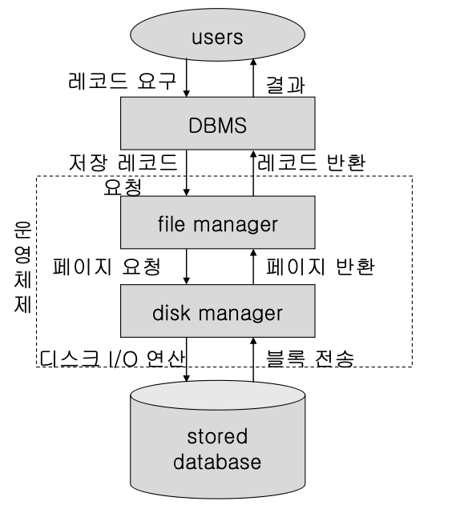

# 데이터베이스의 저장관 접근

- Database의 저장
    - database 저장 장치
        - 데이터를 저장하는 방법과 접근에 영향
        - 직접 접근 저장 장치(DASD: Direct Access Storage Device)인 Disk를 사용
            - nonvolatile storage
            - online device
    - 임의 접근시간(random access time)
        - 데이터 접근 시간(data access time)
        - 헤드가 원하는 트랙에 있는 레코드를 찾아 전송하는데 걸리는 시간
        - 탐구 시간(탐색시간, seek time) + 회전지연 시간(rotational delay) + 데이터 전송 시간(block transfer time)
        - 약 10~30ms: 메인 메모리 접근시간(10~100ns)에 비해 매우 느림
        - 실제 데이터 전송 시간은 전체의 10분의 1
        - 대량 전송률(bulk transfer rate) – 연속적인 블록을 전송하는 시간
    - database의 성능 향상의 초점은 디스크 접근 횟수의 최소화
        - 디스크에 배치, 저장하는 방법이 중요한 문제
- Database의 접근
    - Database의 접근 과정
        - DBMS는 사용자가 요구하는 레코드를 결정
            - file manager에게 그 저장 레코드의
            검색을 요청
        - file manager는 저장 레코드가 들어있는 페이지(블록)를 결정
            - disk manager에게 그 페이지의 검색을 요청
        - disk manager는 그 페이지(블록)의 물리적 위치를 결정
            - 디스크에 i/o 명령을 내림
                
                
                
    - 디스크 관리자
        - 기본 입출력 서비스 (basic I/O service) 지원 모듈
            - operating system의 한 구성요소
            - 모든 물리적 I/O 연산에 대한 책임
            - 물리적 디스크 주소를 알고 있음
        - 화일 관리자(file manager)를 지원
            - file manager가 디스크를 일정 크기의 페이지(page) 즉, 블록(block)으로 구성된 페이지 세트 (page set) 로취급할수있도록지원
            - page set 중에는 하나의 자유 공간(free space) 페이지 세트가 있음
            - page set는 유일한 페이지 세트 ID를 가짐
            - 각 page는 해당 디스크 내에서 유일한 페이지 번호(page number)를 가짐
        - 디스크를 관리
            - 페이지 번호를 물리적 디스크 주소로 사상
                
                → 화일 관리자를 장비에서 독립
                
            - file manager의 요청에 따라 page set에 대한 페이지의 할당과 회수를 수행
        - Disk manager의 페이지 관리 연산
            - file manager가 명령할 수 있는 연산
                
                1) page set S로부터 페이지 P의 검색
                
                2) page set S 내에서 페이지 P의 교체
                
                3) page set S에 새로운 페이지 P의 첨가
                (자유 공간 page set의 빈 페이지를 할당 받아 새로운 페이지 번호 P를 부여하고 페이지세트S에 추가)
                
                4) page set S에서 페이지 P의 제거 (자유 공간 page set로 반환)
                
        
        <aside>
        💡 Notes
        
        - file manager의 요청에 의한 연산 : 1), 2)
        - disk manager의 필요에 따른 연산 : 3), 4)
        </aside>
        
    - 파일 관리자
        - DBMS가 디스크 저장 공간을 저장 화일**(stored file)**들의 집합으로 취급
        - 저장 화일**(stored file)**
            - 한타입의저장레코드어커런스들의집합
            - 한 page set는 하나 이상의 저장 화일을 저장
            - 화일 이름 또는 화일 ID로 식별
        - 저장 레코드**(stored record)**
            - 레코드 번호 또는 레코드 ID(RID: Record Identifier)로 유일하게 식별
            - 전체디스크내에서유일
            - <페이지 번호, 오프셋(슬롯 번호)>
        - file manager의 화일 관리 연산
            - DBMS가 file manager에게 명령할 수 있는 연산
            1) 저장 화일 f 에서 저장 레코드 r을 검색
            2) 저장 화일 f 에 있는 저장 레코드 r을 대체
            3) 저장 화일 f 에 새로운 레코드를 첨가하고 새로운 레코드 ID, r을 반환
            4) 저장 화일 f 에서 저장 레코드 r을 제거
            5) 새로운 저장 화일 f 를 생성
            6) 저장 화일 f 를 제거
- page set과 파일
    - disk manager의 페이지 관리(page management)
        - file manager 가 물리적 디스크 I/O가 아닌 논리적인 페이지 I/O를 수행할 수 있게끔 지원하는 disk manager의 기능
    - 대학(University) 데이터베이스 예
        - 레코드들의 논리적 순서는 그림에 있는 것과 같이 각각 학번, 과목번호, 학번-과목번호 순임
        - 저장순서도이논리적순서와같음
        - 저장 화일들은 28개의 페이지로 구성된 page set에 저장
        - 각 레코드들은 하나의 페이지를 차지
    - 대학 데이터베이스의 예제
        
        
        
        - 연산 과정 - 1
            - 처음(빈 디스크) :
                - 하나의 자유 공간 page set만 존재(1 ~ 27)
                - 페이지 0 제외 : 디렉터리(directory)
            - file manager: 5개의 학생 화일 레코드를 삽입
                - disk manager : 자유 공간 page set의 페이지 1에서 5까지를 "학생 page set" 이라고 이름을 붙이고 할당
            - 과목과 등록 화일에 대한 페이지 세트를 할당
                - 4개의 page set가 만들어짐
                - "학생"(1~5), "과목"(6~10), "등록"(11~21), "자유 공간" page set (페이지 22~27)
            
            
            
        - 연산과정 - 2
            - file manager : 새로운 학생 S6 (학번 600)을 삽입
                - disk manager : 첫번째 자유 페이지 (페이지 22)를 자유 공간 page set에서 찾아서 학생 page set에 첨가
            - file manager : 학생 S2 (학번 200)를 삭제
                - disk manager : S2가 저장되어 있던 페이지 (페이지 2)를 자유 공간 page set로 반납
            - file manager : 새로운 과목 C6 (E 515)를 삽입
                - disk manager : 자유 공간 page set에서 첫 번째 자유 페이지 (페이지 2)를 찾아서 과목 page set에 첨가
            - file manager : 학생 S4를 삭제
                - disk manager : S4가 저장되어 있던 페이지 (페이지 4)를 자유 공간 page set에 반납
            
            
            
            <aside>
            💡 물리적 인접성이 없어짐에 주의
            
            </aside>
            
        - 포인터 표현 방법 - 1
            - 한 page set에서 페이지의 논리적 순서를 물리적 인접으로 표현하기 어려움
            - 페이지 헤드에 제어 정보(control information)를 저장
                - 다음 페이지(next page) 포인터
                    - 논리적 순서에 따른 next page의 물리적 주소
                    - next page 포인터는 disk manager가 관리 (file manager는 무관)
            
            
            
        - 포인터 표현 방법 - 2
            - disk directory(page set 디렉터리)
                - 실린더 0, 트랙 0에 위치
                - 디스크에 있는 모든 page set의 리스트와 각 page set의 첫 번째 페이지에 대한 포인터를 저장
            - disk directory (페이지 0)
            
            
            
        - 파일 관리자의 기능
            - 저장 레코드 관리 (stored record management) 기능
                - DBMS가 페이지 I/O에 대해 알 필요 없이 저장 화일과 저장 레코드로 처리할 수 있도록 지원
            - 예
                - 하나의페이지에여러개의레코드저장
                - 학생레코드에대한논리적순서는학번순
            1. 페이지 p에 5개의 학생 레코드(S1~ S5)가 삽입되어 있다고 가정
            
            
            
            1. DBMS : 학생 레코드 S9(학번 900)의 삽입 요청
                - 페이지 p의 학생 레코드 S5 바로 다음에 저장
            2. DBMS : 레코드 S2의 삭제 요청
                - 페이지 p에 있는 학생 레코드 S2 를삭제하고 뒤에 있는 레코드들을 모두 앞으로 당김
            3. DBMS : 레코드 S7(학번 700)의 삽입 요청
                - 학생 레코드 S5 다음에 들어가야 되므로 학생 레코드 S9를 뒤로 옮김
            
            
            
        - RID의 구현
            - RID = <페이지 번호 p, 오프셋(슬롯번호)>
            - 오프셋 내용 = 페이지 시작에서부터 저장된 레코드의 위치(byte 수) 를저장
            - 레코드의 위치가 변경되면 RID의 변경 없이 오프셋의 내용만 변경
            - 최악의 경우 두 번의 접근으로 원하는 레코드 검색 가능
                - 해당 페이지가 overflow가 되어 다른 페이지로 저장된 경우 두 번 접근 (이 경우 오프셋에는 이동된 페이지의 번호와 오프셋이 저장)
            
            
            
- File의 조직 방법
    
    
    
    - 순차 방법
        - 레코드들의 논리적 순서가 저장 순서와 동일
            - 히프(heap) 또는 파일(pile) : 엔트리 순차(entry-sequence) 화일
            - 일반적인 순차 화일 : 키 순차(key-sequence) 화일
        - 레코드 접근 - 물리적 순서
        - 화일 복사, 순차적 일괄 처리(batch processing) 응용
        
        
        
    - 인덱스 방법
        - 인덱스를 통해 데이터 레코드를 접근
        - 인덱스된 파일의 구성
            - 인덱스 파일
            - 데이터 파일
        
        
        
    - 인덱스된 순차 파일
        - 하나의 인덱스(일반적으로 기본 키)를 사용
        - 순차 접근(sequential access) 과 직접 접근(direct access) 을 지원
        - 순차 데이터 화일(sequential data file)
            - 레코드를 순차적으로 정렬
            → 레코드 집합 전체에 대한 순차 접근 요구를 지원하는데 사용
            - 순차 접근 방법(sequential access method)
        - 인덱스(index)
            - 레코드들에 대한 포인터
            → 개별 레코드들에 대한 임의 접근 요구를 지원하는데 사용
            - 직접 접근 방법(direct access method)
    - 다중 키 파일
        - 데이터를 중복시키지 않으면서 여러 방법으로 데이터를 접근할 수 있는 경로를 제공
        - 역 화일(inverted file)
            - 각 응용에 적합한 인덱스를 선정하여 구축
        - 다중 리스트 화일(multilist file)
            - 하나의 인덱스 값마다 데이터 레코드 리스트를 구축
        
        
        
    - 인덱스 종류
        - 인덱스의 구조
            - <레코드 키 값, 포인터(레코드 주소)>
            - 여기서 레코드 키 값은 탐색 키 값 (search key value)
        - 기본 인덱스(primary index)
            - 기본 키(primary key)를 포함한 인덱스
            - 하나의 레코드만 식별
        - 보조 인덱스(secondary index)
            - 보통 보조 키(secondary key)를 포함
            - 여러 개의 레코드를 식별
        - 집중 인덱스(clustering index)
            - 탐색 키 값(search key value) 순서와 데이터 레코드의 물리적 순서가 같도록 구성된 인덱스
                - 기본 인덱스는 집중 인덱스의 특수한 경우
            - 화일에하나만존재가능
            - 동일한 탐색 키 값을 가진 레코드는 물리적으로 집단화 되어 검색이 효율적
        - 비 집중 인덱스(nonclustering index)
            - 집중 인덱스가 아닌 인덱스
            - 하나의데이터화일에여러개존재가능
        - 밀집 인덱스(dense index)
            - 모든 탐색 키 값(search key value)에 대해 하나의 인덱스 엔트리가 만들어진 인덱스
            - 역 인덱스(inverted index)는 보통 밀집 인덱스 형태
            - 희소 인덱스(sparse index)
                - 일부 탐색 키 값에 대해 인덱스 엔트리가 만들어진 인덱스
- B트리
    - 차수가m인B-트리의특성
    1. 공백이거나 높이가 1이상인 m-원 탐색 트리(m-way search tree)
    2. 루트(root)와 리프(leaf)를 제외한 내부 노드 (internal node)는 최소 ⌈m/2⌉, 최대 m개의 서브트리(subtree)를 가짐(적어도 ⌈m/2⌉-1개의 키 값을 가짐)
    3. 루트는 그 자체가 리프가 아닌 이상 적어도 두 개의 서브 트리를 가짐
    4. 모든 리프는 같은 레벨(level)에 있음
        - 균형 트리(balanced tree)
    
    <aside>
    💡 차수는 서브트리의 최대 수
    
    </aside>
    
    
    
    - B-트리에서의 연산
        - 직접 탐색 : 키 값에 의한 분기
        - 순차 탐색 : 중위 순회(inorder traversal)로 가능
        - 삽입, 삭제 : 연산 뒤에 트리의 균형을 유지해야 해야 됨
        - 분할(split) : 노드의 오버플로 발생시
        - 합병(merge) : 노드의 언더플로(최소의 키 수보다 적음) 발생시
    - 삽입
        - 삽입은 항상 리프 노드에서 수행하게 됨
            - 빈 공간이 있는 경우 : 단순히 빈 공간에 삽입하면 됨
            - 오버플로(m개 이상의 키 값)
                
                1) 두 노드로 분할(split)
                2)[m/2] 번째의 키 값→ 부모 노드에 삽입
                3) 나머지는 반씩 왼쪽, 오른쪽 서브트리가 됨
                
    - 삭제
        - 리프노드에서는그대로삭제
        - 삭제할키가리프가아닌노드에존재하는경우
            - 후행키값(항상리프에있음)과자리교환을하고리프노드에서삭제
        - 키값의수<⌈m/2⌉-1이되어언더플로가발생하는경우
            
            1. 재분배 (redistribution)
            
            - ⌈m/2⌉개 이상의 키를 가지고 있는 형제 노드가 있는 경우에 그 형제 노드로부터 키를 이동
            (부모 노드의 키 → 언더플로 노드의 키)
            (형제 노드의 키 → 부모 노드의 키)
            
            2. 합병 (merge)
            
            - 재분배불가능시
            (형제 노드 + 부모 노드의 키 + 언더플로 노드)
- 해싱
    - 다른 레코드의 참조 없이 목표 레코드의 접근을 직접 지원
        - 직접 화일(direct file)
    - 키(key) 값과 레코드 주소(address) 사이의 사상(mapping) 관계를 함수로 설정
    - 해싱 함수(hashing function)
        - 키(key) 값으로부터 레코드 주소(address)를 계산
        - 사상 함수(mapping function) : 키 → 주소
        - 삽입, 검색에 모두 이용
    - 버킷 해싱
        - 버킷(bucket)
            - 하나의 주소를 가지면서 하나 이상의 레코드 를 저장할 수 있는 화일의 한 구역
            - 버킷 크기: 저장 장치의 물리적 특성과 한번 접근으로 채취 가능한 레코드 수를 고려
            - 버킷 해싱 : 키 → 버킷 주소
            - 충돌(collision) : 상이한 레코드들을 같은 주소(버킷)로 변환
                - 동거자(synonym)
                - 버킷 만원 - 오버플로 버킷
                - 한번의 I/O가 추가됨
            
            
            
        - 확장성 해싱
            - 충돌에 대처하기 위해 제안된 기법
            - 레코드 검색은 최대 2번의 디스크 접근만 필요
            - 모조 키(pseudokey)
                - 확장성 해싱 함수:
                키 값 → 일정 길이의 비트 스트링, pseudokey로 변
                - pseudokey의 처음 d 비트를 디렉터리의 인덱스로 사용
            - 디렉터리(directory)
                - 헤더에 현재의 디렉터리 깊이 d를 유지
                    - d : 전역 깊이(global depth)
                - $2^d$ 개의 버킷들을 지시할 수 있는 포인터 엔트리로 구성
                - 디스크에 저장
            - 버킷
                - 헤더에 현재의 버킷 깊이 p를 유지 (p≤ d)
                - p : 지역 깊이 (local depth)
                - 각 버킷에 저장된 레코드들의 모조 키들은 처음 p 비트가 모두 동일
                
                
                
        - 해싱의 연산
            - 검색
                - 모조 키의 처음 d 비트를 디렉터리에 대한 인덱스로 사용
                - 접근된 디렉터리 엔트리는 목표 버킷에 대한 포인터를 제공
                - 검색 예
                    
                    1) 레코드 키 값 k → 모조키 101000010001
                    
                    2) 디렉터리의 깊이(d)가 3이므로 모조 키의 처음 3 비트를 사용
                    
                    - 디렉터리의 6번째(101) 엔트리로 접근
                    
                    3) 엔트리는 4번째 버킷에 대한 포인터
                    
                    - 키 값 k를 가지고 있는 레코드가 저장되어있는 버킷
                    - 버킷 깊이, p= 1 : 모조 키의 공통 비트 수가 1,즉 이 버킷은 비트 1로 시작하는 레코드들을 저장
            - 저장
                - 저장할 레코드 모조 키의 처음 d 비트로 디렉터리를 접근
                - 엔트리 포인터가 지시하는 버킷에 레코드를 저장
                - 버킷의 오버플로 처리
                - 새로운 버킷을 할당
                    - 버킷의 깊이가 p인 오버플로된 버킷과 새로 할당된 버킷의 깊이를 모두 (p+1)로 설정
                    - 오버플로된 버킷에 있는 레코드들과 새로 저장할 레코드를 모조키의 (p+1)번째 값에 따라 기존의 오버플로된 버킷과 새로 할당한 버킷에 분산
                    - 이때 만일 d< (p+1)이 되면 디렉터리 오버플로가 발생
                    - d 값을 1 증가시켜 디렉터리 크기를 2배로 확장
                    - 2배로 증가된 디렉터리 엔트리 포인터들을 모두 조정
        - 버킷 오버플로우의 예시
            - 모조키가 10으로 시작하는 레코드를 저장. 네 번째 버킷은 오버플로
            - 빈 버킷을 할당하고 버킷을 분할 : 버킷의 깊이 p는 모두 2로 설정
                - 오버플로된 버킷에는 모조키 10으로 시작하는 레코드만 남김
                - 새 버킷에는 모조키 11로 시작하는 레코드를 이동시켜 저장
            - 디렉터리의 110과 111의 포인터 값이 새 버킷을 지시하도록 조정
            
            
            
            - 첫 번째 버킷(000)이 만원인 경우의 레코드 삽입
                - 버킷 깊이 p를 1 증가시키고 버킷을 분할
                - 빈버킷을할당받고p는 p+1 로설정
                - 모조키가 0001로 시작되는 모든 레코드를 새로운 버킷으 로이동
                - 이때 d< (p + 1)이 되므로 d를 d+1로 증가시켜 디렉터리를 2 배로 확장
                - 확장된 디렉터리의 모든 포 인터를 재조정
            
            
