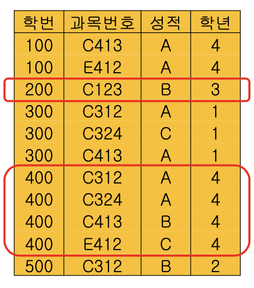

# 모델링

- World of Data
    
    
    
    - 현실 세계(real world)의 구조적 표현
        
        → 데이타베이스 설계(database design)
        
    
    i. 개념적 모델링(conceptual modeling)
    
    - 현실 세계를 추상적 개념 (abstract concepts), 개체 타입(entity type)으로 표현
    - 개념적 구조(conceptual structure)
    - 개념적 설계 (conceptual design)
    
    ii. 데이타 모델링 (logical modeling)
    
    - 개념적 구조를 논리적 개념(logical concepts), 레코드 타입(record type)으로 표현
    - 논리적 구조(logical structure), 데이타 모델(data model)
    - 논리적 설계 (logical design)
    
    iii. 데이타 구조화(data structuring)
    
    - 논리적 구조를 물리적 구조(physical structure)로 표현
    - 물리적 설계 (physical design)
    - 저장장치에서의 데이타표현
    
    
    
- Data Model
    - 데이타베이스 설계(database design) 과정의 일부
        - 설계의 핵심은 개념적인 구조와 논리적인 구조를 거쳐 실제 데이타를 저장할 수 있는 물리적 구조로 변환하는 것
    - 개념적 데이타 모델링(conceptual data modeling)
        - 애트리뷰트(attribute)들로 기술된 개체 타입(entity type)과 이 개체 타입들 간의 관계(relationship)를 이용하여 현실 세계를 표현하는 방법
        - 가장 대표적인 모델이 개체-관계 모델(E-R Model : Entity-Relationship model)
    - 논리적 데이타 모델링(logical data modeling)
        - 데이타 필드(field)로 기술된 레코드 타입(record type)과 이 레코드 타입들 간의 관계를 이용하여 개념 세계를 표현하는 방법
        - 관계 데이타 모델(relational data model), 네트워크 데이타 모델(network data model), 계층 데이타 모델(hierarchical data model), 객체 지향데이타 모델(object-oriented data model), 객체-관계 데이타 모델(object-relational data model)
    - 데이타 모델(data model: D)
        
        D = <S, O, C>
        
    - S : 논리적으로 표현된 데이터 구조(structure)
        - 데이터의 정적 성질(static properties)
        - 개체 타입과 이들 간의 관계를 명세
    - O : 주어진 구조에서 허용되는 연산(operation)
        - 데이타의 동적 성질(dynamic properties)
            - 데이타베이스 상태: 한 시점에 데이터베이스에 표현되어 있는 개체 인스턴스들(값들)
            - 연산을통하여한상태에서다른한상태로전이
        - 개체 인스턴스(instance)를 처리하는 작업에 대한 명세
        - 데이타의 조작 기법
    - C : 제약 조건(constraints)
        - 데이타의 논리적 제약(logical constraints)
            - 개체 인스턴스의 존재 조건
            :구조(S)로부터 파생 되는 구조적 제약
            :의미상 제약
        - 데이타 조작의 한계를 표현하는 규정
    - 논리적 데이타 모델 중에서 가장 많이 사용되고 있는 모델은 관계 데이타 모델 (relational data model)
    - 그 이전에는 네트워크 데이타 모델(network data model) 과 계층 데이타 모델 (hierarchical data model)이 많이 사용됨
    - 최근에는 객체 지향 데이타 모델(object-oriented data model)과 객체-관계 데이타 모델 (object-relational data model)이 사용
    - DBMS는 하나의 논리적 데이타 모델만을 구현
        - 모델 간의 주요 차이점은 데이타 요소 간의 관계(relationships)를 표현하는 방식
- Entity Type
    - 개체 (entity)
        - 단독으로 존재할 수 있으며 다른 것과 구별되는 객체(object)
    - 개체 타입(entity type)
        - 이름(name)과 애트리뷰트(attribute)들로 정의됨
        - 똑같은 애트리뷰트들로 구성된 개체의 공통된 논리적 구조
        - 개체 집합(entity set)
            - 한 개체 타입에 대한 개체 인스턴스(instance)들의 집합
    - 애트리뷰트(attribute)의 유형
        
        i. 단순 애트리뷰트와 복합 애트리뷰트
        ii. 단일 값 애트리뷰트와 다중 값 애트리뷰트
        iii. 유도 애트리뷰트와 저장 애트리뷰트
        iv. 널(null) 애트리뷰트
        
    - 단순 애트리뷰트와 복합 애트리뷰트
        - 단순 애트리뷰트(simple attribute) : 더 이상 작은 구성원소로 분해할 수 없는 애트리뷰트
        - 복합 애트리뷰트(composite attribute)는 몇 개의 기본적인 단순 애트리뷰트로 분해할 수 있는 애트리뷰트
        
        
        
    - 단일 값 애트리뷰트와 다중 값 애트리뷰트
        - 단일 값 애트리뷰트(single-valued attribute)
            - 대부분의 애트리뷰트들은 특정 개체에 대해 하나의 값을 가짐
            - “학생” 개체 타입의 name(이름) 애트리뷰트 : 각 개체에 대해 하나의 값만 가짐
        - 다중 값 애트리뷰트(multivalued attribute)
            - 한 개체에 대해서 몇 개의 값을 가지고 있을 수 있음
            - “학생” 개체 타입에 hobby(취미) 애트리뷰트 : 학생에 따라서는 두 개이상의 취미를 가질수있음
            - 현실적으로 다중 값 애트리뷰트로 처리하기 위해서 값의 최대 수 제한 가능
    - 유도 애트리뷰트와 저장 애트리뷰트
        - 유도 애트리뷰트(derived attribute)
            - 애트리뷰트의 값이 다른 애트리뷰트나 개체가 가지고 있는 값으로부터 유도되어 결정되는 경우
        - 저장 애트리뷰트(stored attribute)
            - 유도 애트리뷰트를 생성하는데 사용된 애트리뷰트
        - 과목별 평균 성적을 표현하는 “과목**-**성적” 개체 타입의 “평균 성적” 애트
        리뷰트인 경우
            - “평균 성적” 애트리뷰트의 값은 등록 개체 타입의 “성적” 애트리뷰트 값을 평균한 결과로 결정
            - “평균 성적” 애트리뷰트 : 유도 애트리뷰트
            - 이를 위해 사용된 “성적” 애트리뷰트 : 저장 애트리뷰트
    - 널 애트리뷰트 (null attribute)
        - 널 값(null value)을 갖는 애트리뷰트
        - 널 값은 어떤 개체 인스턴스가 어느 특정 애트리뷰트에 대한 값을 가지고 있지 않을 때 이를 명시적으로 표시하기 위해 사용
    - 널(null)값을 갖는 경우
        - 그 애트리뷰트 값이 그 개체에 “해당되지 않는”(not applicable) 경우
        - 그 애트리뷰트 값을 “알 수 없는”(unknown) 경우
            - 그 값이 존재하지만 값이 “누락”(missing)인 경우
            - 그 값이 존재하고 있는지 조차 알 수 없어 “모르는”(not known) 경우
- Relationship Type
    - 관계 타입(relationship type)
        - 개체간의연관을통해의미를표현하는개체타입의한특수형태
        - 개체 집합(타입)들 사이의 대응(correspondence), 즉 사상(mapping)을 의미
        
        
        
        
        
    - 사상 원소 수
        
        
        
        
        
    - relationship type의 특성
        - 전체 참여(total participation)
            - A-B 관계에서 개체 집합 A의 모든 개체가 A-B 관계에 참여
            - ex) 교수 – 학과 관계
        - 부분 참여(partial participation)
            - A-B 관계에서 개체 집합 A의 일부 개체만 A-B 관계에 참여
            - ex) 학생– 과목 관계에서 학생(휴학생 제외) 일부만 참여
        - 존재 종속(existence dependence)
            - 어떤 개체 b의 존재가 개체 a의 존재에 종속됨
            - b는 a에 존재 종속
            - a: 주 개체(dominant entity): 강성 개체
                
                b: 종속 개체(subordinate entity): 약성 개체
                
        
        
        
- E-R Model
    - 개체 – 관계 모델(Entity-Relationship model)
        - 개념적 데이타 모델(conceptual data model)
    - 현실 세계의 개념적 표현
    - 개체 타입(집합)과 관계 타입(집합)을 기본 개념으로 현실 세계를 개념적으로 표현하는 방법
    - 개체 집합(entity set)
        - 한 개체 타입에 속하는 모든 개체 인스턴스**(entity instance)**
    - 관계 집합(relationship set)
        - 한 관계 타입에 속하는 모든 관계 인스턴스**(relationship instance)**
    
    
    
    - 특징
        - 다 대 다(m : n) 관계 표현
        - 다원 관계(n-ary relationship) 표현
            - 두개 이상의 개체 타입이 하나의 관계에 관련 가능
        - 다중 관계(multiple relationship) 표현
            - 두 개체 타입 사이에 둘 이상의 관계가 존재 가능
        - 관계 타입도 속성(attribute)을 가질 수 있음
    - entity type & key attributes
        - 키 애트리뷰트(key attributes)
            - 한 개체 집합 내에서 각 개체마다 상이한 값을 갖는 애트리뷰트나 애트리뷰트 집합
        - 키(key)
            - 개체 타입 내의 모든 개체 인스턴스들을 유일하게 식별
            - 동일한 키 값을 갖는 두 개의 개체 인스턴스는 없음
        - E-R 다이어그램 상에서 밑줄로 표시
    - weak entity type
        - 약한 개체 타입(weak entity type)
            - 자기자신의 애트리뷰트만으로는 키를 명세할 수 없는 개체 타입 ↔ 강한 개체 타입(strong entity type)
            - 주 개체(dominant entity) – 강한 개체 타입,
            종속 개체 (subordinate entity) – 약한 개체 타입
        - 구별자(discriminator)
            - 강한 개체와 연관된 약한 개체 집합 내에서만 이들을 서로 구별할 수 있는 애트리뷰트
            - 부분 키(partial key)
        - 식별 관계 타입(identifying relationship type)
            - 약한 개체를 강한 개체에 연관시켜 개체를 유일하게 식별하게 하는 관계
        
        
        
- UML
    - **UML**: Unified Modeling Language
    - UML has many components to graphically model different aspects of an entire software system
    - UML Class Diagrams correspond to E-R Diagram, but several differences.
    - Binary relationship sets are represented in UML by just drawin g a line connecting the entity sets. The relationship set name is written adjacent to the line.
    - The role played by an entity set in a relationship set may also b e specified by writing the role name on the line, adjacent to th e entity set.
    - The relationship set name may alternatively be written in a bo x, along with attributes of the relationship set, and the box is connected, using a dotted line, to the line depicting the relatio nship set.
- Logical Data Model
    - 논리적 데이타 모델(logical data model)
        - 개념적 구조를 데이타베이스로 구현하기 위한 중간 단계로 논리적 개념인 레코드(개체) 타입과 관계로 표현
        - 개념적 데이타 모델(conceptual data model)
            - 개체-관계 데이타 모델
            - 현실 세계를 추상적 개념인 개체 타입과 관계 타입으로 표현
    
    
    
    - 네트워크 데이타 모델 (network data model)
    - 계층 데이타 모델 (hierarchical data model)
    - 관계 데이타 모델 (relational data model)
    - 객체지향 데이타 모델 (object-oriented data model)
        - 객체 데이타 모델(object data Model)
    - 객체-관계 데이타 모델 (object-relational data model)
        - 확장 관계 데이타 모델(extended relational data model)
