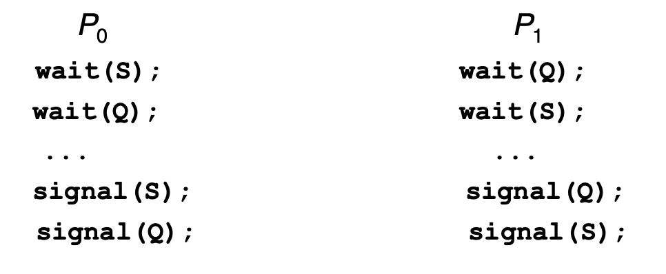

# Synchronization

- 배경
    - 프로세스는 동시다발적으로 실행 될 수 있어야 한다
        - 부분적으로 완료되어, interrupt 될 수 있다
    - 데이터에 동시에 접근하여 데이터 불일치가 발생 할 수 있음
    - 데이터의 일관성을 유지하는것이 협력 프로세스들의 실행에 꼭 필요한 요소다
    - 문제 예시
        - buffer를 채우는 consumer-producer
        - counter가 buffer를 채우는걸 세고 있음
        - counter가 0으로 시작되어 buffer를 채울 때 마다 하나씩 증가
        - Producer
        
        ```c
        while (true) {
        	/* produce an item in next produced */
        	while (counter == BUFFER_SIZE) ; /* do nothing */
        	buffer[in] = next_produced; 
        	in = (in + 1) % BUFFER_SIZE; 
        	counter++;
        }
        ```
        
        - Consumer
        
        ```c
        while (true) {
        	while (counter == 0); 
        	/* do nothing */ 
        	next_consumed = buffer[out];
        	out = (out + 1) % BUFFER_SIZE; 
        	counter--;
        	/* consume the item in next consumed */
        }
        ```
        
        Race condition이 일어 날 수 있다
        
        counter++되는 상황에서
        
        ```c
        register1 = counter
        register1 = register1 + 1
        counter = register1
        ```
        
        counter—되는 상황에서
        
        ```c
        register2 = counter
        register2 = regiser2 - 1
        counter = register2
        ```
        
        S0: producer execute **register1 = counter**              {register1 = 5}
        ****S1: producer execute **register1 = register1 + 1**      {register1 = 6}
        ****S2: consumer execute **register2 = counter**            {register2 = 5}
        ****S3: consumer execute **register2 = register2 – 1**   {register2 = 4}
        ****S4: producer execute **counter = register1**              {register2 = 6}
        ****S5: consumer execute **counter = register2**            {register2 = 4}
        
- 임계구역
    - n 개의 프로세스가 있는 시스템인 경우 → 프로세스는 임계구역을 포함하고 있다고 가정
    - 진입구역(entry section)과 퇴출구역(exit section)을 필요로 한다.
    - 진입구역과 퇴출구역 사이에 임계구역, 퇴출구역 후에 나머지 구역이 할당된다
    - 임계구역 문제에 대한 해결안은 세가지를 충족해야 한다
        - 상호배제 (Mutual Exclusion) : 프로세스가 자신의 임계구역에서 실행된다면 다른 프로세스들은 실행 될 수 없다
        - 진행 (Progress) : 자신의 임계구역에서 실행되는 프로세스가 없고, 임계꾸역으로 진입하려는 프로세스가 있다면, 나머지 구역에서 실행중이지 않은 프로세스들만 다음에 누가 임계구역으로 진입할 수 있는지 결정하는데 참여 할 수 있으며 연기 될 수 없다 → 다음 프로세스에게 기회를 줄 수 있어야 한다
        - 한정된 대기 (Bounded Waiting) : 프로세스가 자신의 임계구역에 진입하려는 요청을 한 후 부터 허용될 때 까지 다른 프로세스들이 임계구역에 진입하도록 허용되는데 한계가 있어야 한다 → 평생 대기 할 수 없고 보장 받을 수 있어야 한다
    - 선점형 커널
        - 커널모드에서 수행되는 동안 선점된다 → 스스로 놓기전에는 빠져 나가지 않아 race condition이 발생하지 않지만 효율과 성능이 좋지 않다
    - 비선점형 커널
        - 커널모드에서 수행되는 프로세스의 선점을 허용하지 않아 커널을 빠져나갈 때 까지 or 봉새될 때 까지 or CPU를 양보할 때 까지 수행된다
- Peterson 해결안
    - load / store 과 같은 기본적인 기계어가 atomic 하게 진행된다고 가정
    - flag 변수로 임계구역으로 진입할 준비가 되었는지 확인 후 진입한다
    - flag[i]가 참이라면 임계구역으로 갈 수 있다.
        1. 상호배제가 제대로 지켜진다
        2. 진행에 대한 요구조건을 만족한다
        3. 대기시간이 한없이 길어지지 않는다
    
    ```c
    do {
    	flag[i] = true;
    	turn = j;
    	while (flag[j] && turn = = j);  //entry section
    		/* critical section */
    	flag[i] = false;  //exit section
    		/* remainder section */
    } while (true);
    ```
    
- 동기화를 위한 하드웨어 지원
    - 들어가면 interrupt disable 하지만 multicore 사용 시 성능이 떨어진다
    - Atomic 한 수행으로 해결 할 수 있다
    - Test and Set
        
        ```c
        boolean test_and_set (boolean *target) {
                     boolean rv = *target;
                     *target = TRUE;
                     return rv:
        }
        ```
        
        1. Atomic 하게 실행된다
        2. 호출된 값을 반환한다
        3. 새로 받은 호출값은 TRUE로 재설정을 한다
        
        ```c
        do { //lock == 0
        	while (test_and_set(&lock)); /* do nothing */
        		/* critical section */
        	lock = false;
        		/* remainder section */
        } while (true);
        ```
        
        활용 예시
        
        ```c
        do {
        	waiting[i] = true; //Ready to enter
        	key = true; //
        	while (waiting[i] && key) //If i'm only one waiting
        		key = test_and_set(&lock);  //set key to false and enter
        																//If someone else using -> key = true and wait
        	waiting[i] = false; //Entering
        			/* critical section */
        	j = (i + 1) % n; //j is next person
        	while ((j != i) && !waiting[j]) //serach next person waiting
        		j = (j + 1) % n;
        	if (j == i) //no one waiting -> set lock free
        		lock = false;
        	else //if there is waiting -> let person enter leaving lock true
        		waiting[j] = false;
        			/* remainder section */
        } while (true);
        ```
        
    - Compar and Swap
        
        ```c
        int compare _and_swap(int *value, int expected, int new_value) { 
        	int temp = *value;
        
        	if (*value == expected)
        		*value = new_value;
        	return temp;
        }
        ```
        
        1. Atomic 하게 실행된다
        2. 호출된 값을 반환한다
        3. 받은 값이 원하던 값과 일치하다면, 새로운 값으로 바꿔준다
        
        ```c
        do {
        	while (compare_and_swap(&lock, 0, 1) != 0); /* do nothing */
        			/* critical section */
        	lock = 0;
        			/* remainder section */
        } while (true);
        ```
        
- Mutex Locks
    - 앞선 해결책들은 프로그래머가 사용하기 어렵다
    - OS 설계자들이 사용하기 가장 쉬운 예제 → Mutex Lock
    - acquire() 함수로 lock을 획득하고 release() 로 해제한다 → Atomic하게 실행
    - 하지만 아직 busy waiting으로 spinlock 형태이다
    
    ```c
    acquire() {
    	while (!available); /* busy wait */
    	available = false;;
    }
    
    release() {
    	available = true;
    }
    
    do{
    	acquire lock
    		/* critical section */
    	release lock
    		/* remainder section */
    } while (true);
    ```
    
- Semaphore
    - 유사하지만 더 복잡한 방법으로 구현한다
    - S를 정수 변수로 사용해 wait() & signal() 함수를 사용한다
    
    ```c
    wait(S) {
    	while (S <= 0); // busy wait
    	S--;
    }
    
    signal(S) { 
    	S++;
    }
    
    P1:
    	S1;
    	signal(synch);
    P2:
    	wait(synch);
    	S2;
    /* 이렇게 사용 시 S1이 항상 S2보다 먼저 실행 되어야 한다
    ```
    
    - Counting Semaphore
        - 이진 세마포어처럼 사용가능하지만, 정수로 사용한다
    - Binary Semaphore
        - Mutex Lock과 동일하게 사용 할 수 있다
    - 하지만 아직 Busy Waiting한 상황이며 극복하기 위해 다른 방법이 필요하다
    - wait()와 signal() 연산을 두 프로세스가 동시에 실행한다면, 임계구역 문제에 해당하여 deadlock 혹은 starvation 상황이 올 수 있다
- Semaphore Implementation without Busy Waiting
    - 각 세마포어마다 해당하는 대기큐를 가지고 있다
    - 각 대기큐에는 Value 와 다음 항목의 포인터를 가지고 있다
    - Block → 프로세스를 세마포에 연관된 대기 큐에 넣고 프로세스의 상태를 대기상태로 전환한다
    - Wakeup → 대기큐에서 꺼내어 다시 준비큐에 넣는다
    
    ```c
    typedef struct{ 
    	int value;
    	struct process *list; 
    } semaphore;
    
    wait(semaphore *S) { 
    	S->value--;
    	if (S->value < 0) {
    		add this process to S->list;
    		block(); 
    	}
    }
    
    signal(semaphore *S) {
    	S->value++;
    	if (S->value <= 0) {
    		remove a process P from S->list;
    		wakeup(P); 
    	}
    }
    ```
    
    - 하지만 이러한 상황이 Deadlock을 초래 할 수 있다.
        
        
        
        - 이와같이 동시에 wait한 상황이 와버리면, 서로가 서로를 기다리게 된다.
    - Starvation
        - 한 프로세스가 대기큐에 들어가서, 다시 빠져 나오지 못할 수 가 있다
    - Priority Inversion
        - 낮은 우선순위를 가진 프로세스가 락을가져 높은 우선순위의 프로세스가 실행 될 수 없을 수 있다
        - Priority-Inheritance Protocol로 해결
- Classical Problems of Synchronization
    - Bounded-Buffer Problem
        - n buffers에 각 하나를 가질 수 있다
        - mutex = 1, full = 0, empty = n
        
        ```c
        /* Producer */
        do {
        	...
        	/* produce an item in next_produced */
        	... 
        	wait(empty); //empty-- 해보고 0보다 작으면 기다린다
        	wait(mutex); //Producer 나 Consumer 중 1명만 진입가능
        		...
        		/* add next produced to the buffer */
        		...
        	signal(mutex); //임계구역 해제
        	signal(full); //하나 채웠다
        } while (true);
        
        /* Consumer */
        do {
        	wait(full); //full-- 하고 만약 차있는게 없다면 기다림
        	wait(mutex); //임계구역 진입
        		...
        		/* remove an item from buffer to next_consumed */
        		... 
        	signal(mutex); //임계구역 해제
        	signal(empty); //빈칸을 추가해준다
        		...
        		/* consume the item in next consumed */
        		...
        } while (true);
        ```
        
    - Readers and Writers Problem
        - Reader는 읽기만 하므로 여러명이 와도 된다
        - Writer → 읽기쓰기를 동시에 하므로 한명만 진입 가능
        - 여러 Reader가 한번에 읽어도 되지만, 중간에 Writer가 오면 어떻게 해결할지
            - Reader가 다 끝나야 Writer 진입?
            - Writer 오자마자 Reader들 다 내보내기?
            - Kernel에서 starvation 오지않게 잘 해결해야된다
        
        ```c
        rw_mutex = 1;
        mutex = 1;
        read_count = 0;
        
        /* Writer */
        do {
        	wait(rw_mutex);//reader가 없어야 진입 가능
        		...
        		/* writing is performed */
        		... 
        	signal(rw_mutex);
        } while (true);
        
        /* Reader */
        do { 
        	wait(mutex); //rw_mutex와 read_count 안전하게 실행하기위해
        	read_count++;
        	if (read_count == 1) //first reader
        		wait(rw_mutex); //no writer can enter
        	signal(mutex); //변수들 설정 완료
        		...
        		/* reading is performed */
        		...
        	wait(mutex); //다시 read_count/rw_mutex 조절
        	read_count--;
        	if (read_count == 0)
        		signal(rw_mutex); //writer can enter
        	signal(mutex); 
        } while (true);
        ```
        
    - Dining-Philosophers Problem
        
        
        
        - 젓가락을 둘 다 집어야 식사 할 수 있다
        - 공유자료 → bowl of rice / chopstick[5]
        
        ```c
        do {
        	wait (chopstick[i] );
        	wait (chopStick[ (i + 1) % 5] );
        	// eat
        	signal (chopstick[i] );
        	signal (chopstick[ (i + 1) % 5] );
        	// think
        } while (TRUE);
        ```
        
        - 해당 코드의 문제 → 동시에 자신의 오른쪽 혹은 왼쪽의 젓가락을 드는 순간 deadlock
        - Handling
            - 최대 4명만 앉을 수 있게 정한다
            - 둘 다 집을 수 있을 때만 집을 수 있게 정한다
            - 홀수번째는 왼쪽부터, 짝수번째는 오른쪽부터 젓가락을 집을 수 있게 설정한다
        - 모니터를 활용한 방법
        
        ```c
        monitor DiningPhilosophers {
        	enum { THINKING, HUNGRY, EATING) state [5]; 
        	condition self [5];
        	void pickup (int i) {
        		state[i] = HUNGRY;
        		test(i);
        		if (state[i] != EATING) 
        			self [i].wait;
        	}
        
        	void putdown (int i) { 
        	state[i] = THINKING;
        		// test left and right neighbors 
        	test((i + 4) % 5);
        	test((i + 1) % 5);
        	}
        
        	void test (int i) {
        		if ( (state[(i + 4) % 5] != EATING) && (state[i] == HUNGRY) &&
        		(state[(i + 1) % 5] != EATING) ) {
        			state[i] = EATING ; 
        			self[i].signal () ;
        		} 
        	}
        	
        	initialization_code() {
        		for (int i = 0; i < 5; i++)
        			state[i] = THINKING; 
        	}
        }
        ```
        
        우선순위를 정해서 Starvation 문제도 해결을 해야한다
        
- Monitor
    - 간단한 동기화 도구들을 통합하여 만든 고급 언어 구조물이다
    - 추상화된 데이터형(ADT)으로 데이터와 데이터를 조작하는 함수들의 집합을 하나의 단위로 묶어 보호한다
    - 모니터형에서 모니터 내부에서 상호배제가 보장되는 프로그래머가 정의한 일련의 연산자 집합을 포함한다
    - 모니터 내에 정의된 함수만이 오직 모니터 내에 지역적으로 선언된 변수들과 형식 매개변수들에만 접근을 할 수 있다
    - 모니터 내의 지역변수는 오직 지역 함수만 접근 할 수 있다
    - condition 이라는 구조물로 제공되어 wait() / signal()로 연산을 다룬다
    - ex) condition x, y; → x.wait(), x.signal()
    - 만약 x.signal() 이 P 에 의해 호출되어 Q를 재개하도록 허용한다면 두가지 선택사항이 있다
        1. Signal and Wait → P는 Q가 모니터를 떠나거나 다른 조건을 기다린다
        2. Signal and Continue → Q는 P가 모니터를 떠나거나 다른 조건을 기다린다
    
    ```c
    semaphore mutex; // (initially = 1) 
    semaphore next; // (initially = 0) 
    int next_count = 0;
    
    /* Procedure F */
    wait(mutex); 
    	/*
    	body of F;
    	*/
    if (next_count > 0)
    	signal(next) 
    else
    	signal(mutex);
    ```
    
    ```c
    /* For condition variable x */
    semaphore x_sem; // (initially = 0)
    int x_count = 0;
    
    /* x.wait */
    x_count++;
    if (next_count > 0)
    	signal(next); 
    else
    	signal(mutex); 
    wait(x_sem);
    x_count--;
    
    /* x.signal */
    if (x_count > 0) { 
    	next_count++;
    	signal(x_sem); 
    	wait(next); 
    	next_count--;
    }
    ```
    
    - 여러 프로세스들이 x에 기다리고 있고, x.signal()을 한다면 어떤게 진행 되어야 하는가
    - FCFS는 적절하지 않다
    - x.wait(c)로 c → 우선순위를 정해주고, 가장 낮은 수가 다음에 진행하게 한다
    
    ```c
    monitor ResourceAllocator {
    	boolean busy; 
    	condition x;
    	void acquire(int time) {
    		if (busy) 
    			x.wait(time);
    		busy = TRUE;
    	}
    	void release() 
    	{
    		busy = FALSE; 
    		x.signal();
    	}
    	initialization code() {
    		busy = FALSE; 
    	}
    }
    ```
